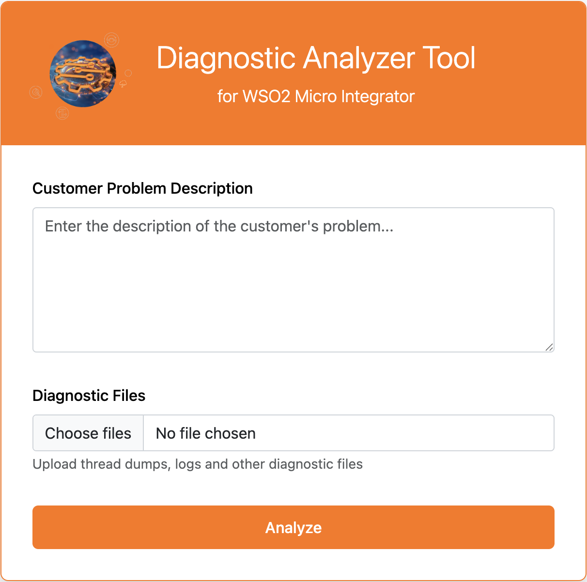
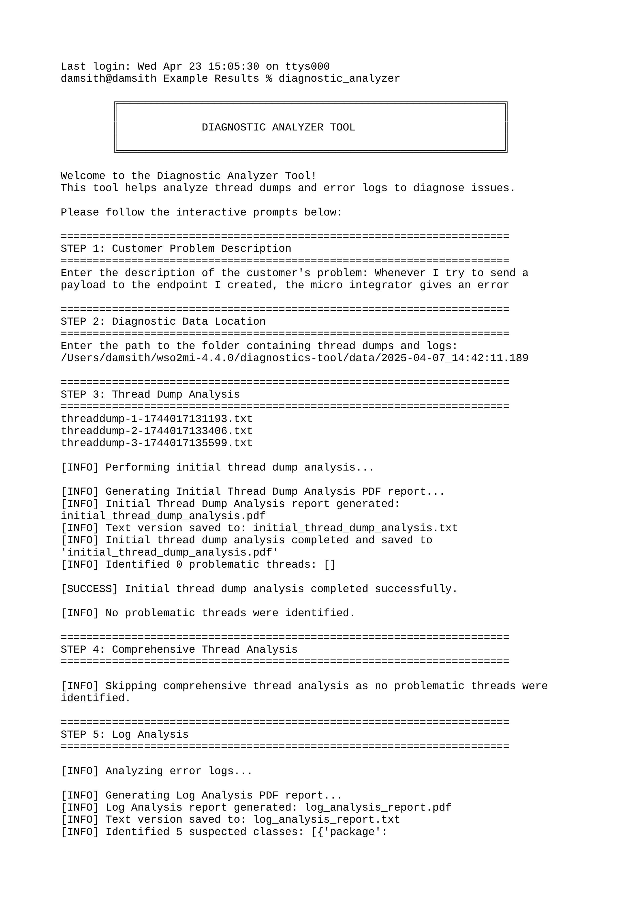
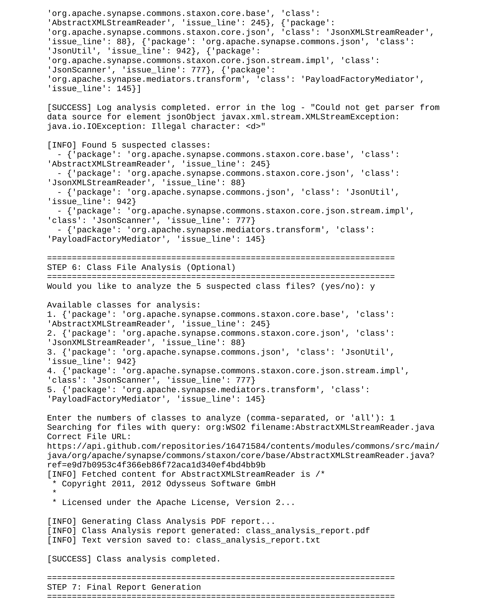
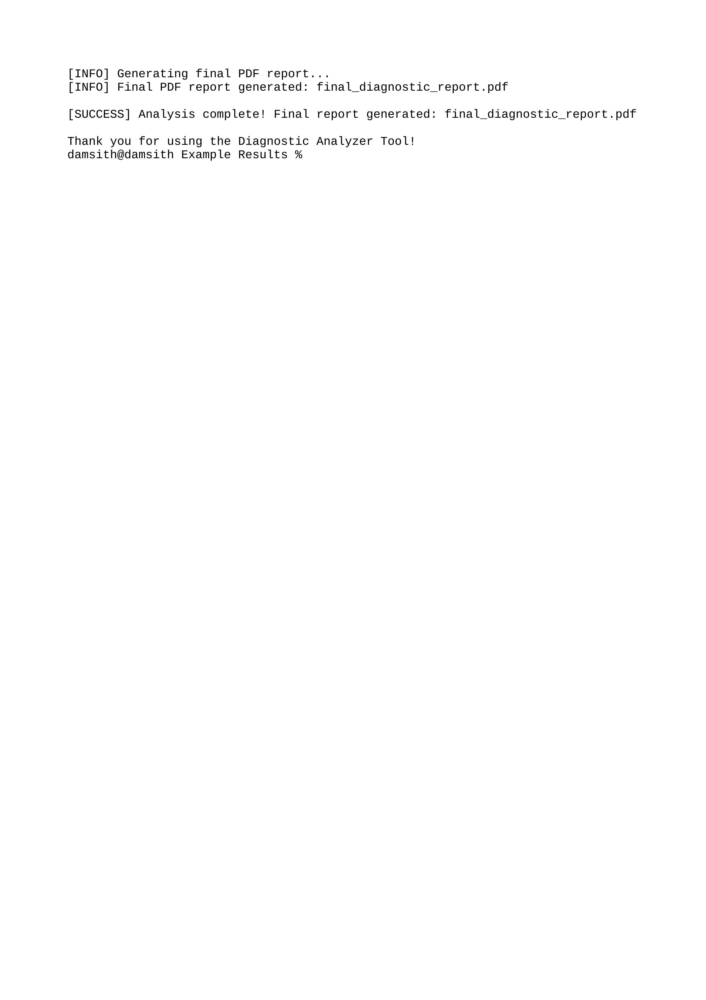

# Diagnostic Analyzer Tool



A powerful interactive diagnostic tool designed to analyze thread dumps and error logs to quickly identify and diagnose application issues.

## 🔍 Overview

The Diagnostic Analyzer Tool is a comprehensive utility for troubleshooting WSO2 Micro Integrator by analyzing the diagnostic tool data which includes thread dumps, error logs, server info and related source files. It provides an interactive command-line interface that guides users through the diagnostic process, from problem description to solution identification.

## ✨ Features

- **Interactive CLI** with step-by-step diagnostic workflow
- **Thread Dump Analysis** that identifies problematic threads and patterns
- **Log File Analysis** to extract error messages and suspect classes
- **Source Code Analysis** for suspected problematic classes
- **Comprehensive Report Generation** with diagnostic conclusions
- **Configurable Thread Groups** for customized analysis

## 🚀 Installation

```bash
# Clone the repository
git clone https://github.com/yourusername/diagnostic-analyzer-tool.git

# Navigate to the directory
cd diagnostic-analyzer-tool

# Install the package
pip install .
```

## 📊 Usage

To run the Diagnostic Analyzer Tool:

```bash
python -m diagnostic_analyzer
```

### Interactive Workflow:

1. Enter the customer problem description
2. Provide the path to the folder containing thread dumps and logs
3. Review thread dump analysis results
4. Review log analysis results
5. Optionally analyze related class files
6. Generate and review a comprehensive diagnostic report

## 🖥️ Example Screenshots





## ⚙️ How It Works

The Diagnostic Analyzer Tool operates through a sequence of analytical steps:

1. **Problem Description Analysis**:
   - Parses the customer problem description to identify key issues

2. **Thread Dump Analysis**:
   - Loads thread dumps from the specified directory
   - Categorizes threads based on predefined thread groups
   - Identifies blocked, waiting, and CPU-intensive threads
   - Extracts stack traces for suspicious threads

3. **Log Analysis**:
   - Parses error logs to identify exceptions and error patterns
   - Correlates log entries with thread activity
   - Identifies potentially problematic classes

4. **Class File Analysis**:
   - Examines source code of suspect classes
   - Identifies potential code issues related to the problem

5. **Diagnostic Conclusion**:
   - Combines all analysis results
   - Generates a comprehensive report with potential solutions

## 📂 Project Structure
```
├── .gitignore
├── diagnostic_analyzer_package
    ├── ThreadGroups.json
    ├── __init__.py
    ├── final_analyzer.py
    ├── log_analyzer.py
    ├── main.py
    ├── prompts.py
    ├── report.py
    ├── thread_analyzer.py
    ├── thread_dump_processor.py
    └── utils.py
└── setup.py
```