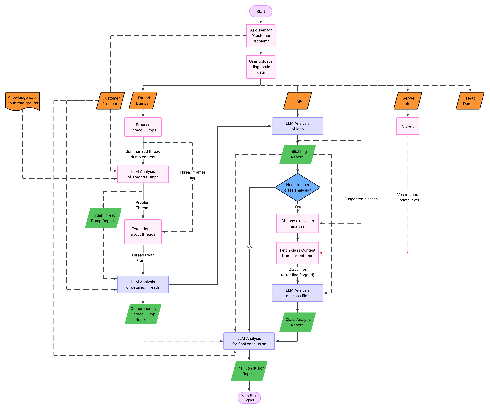
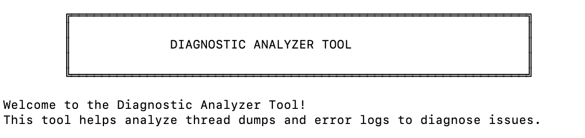
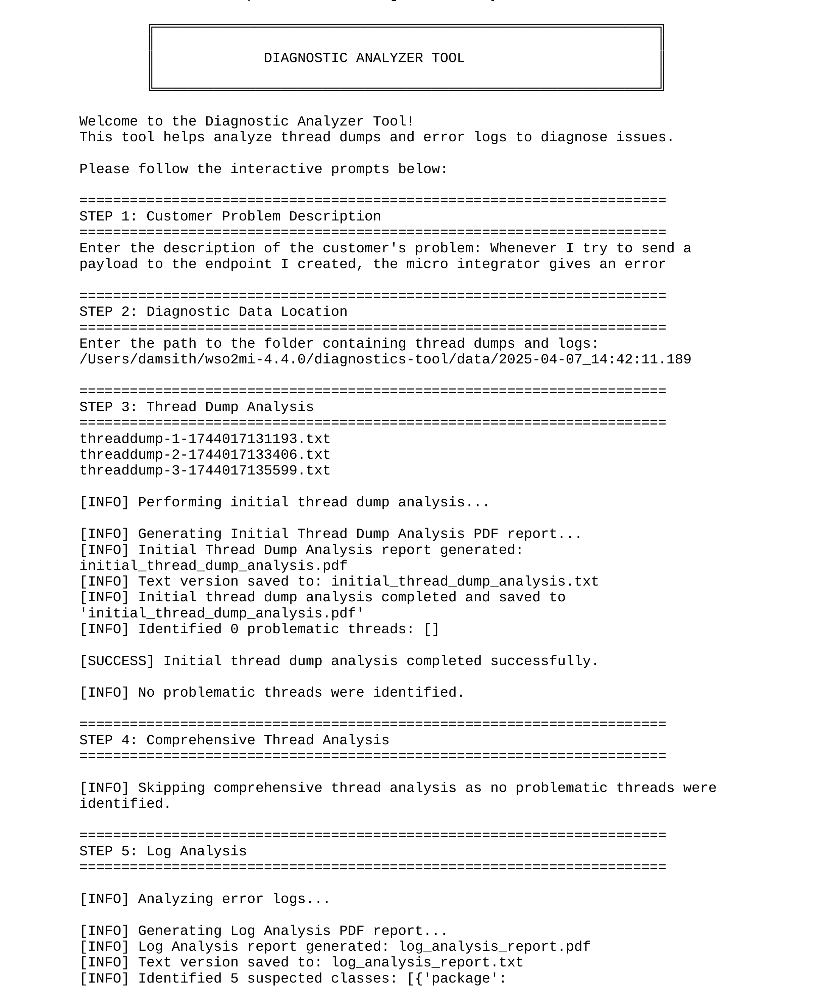
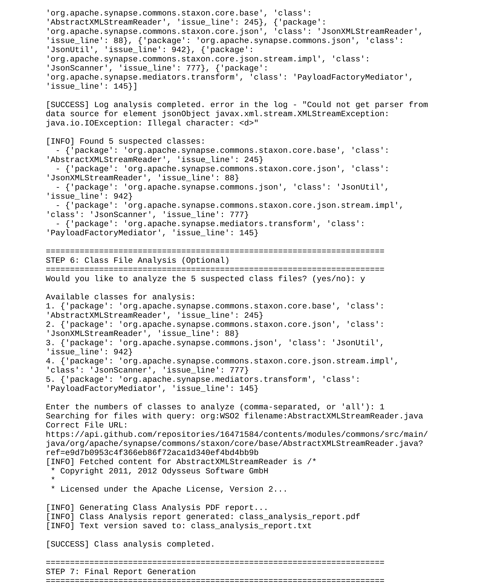
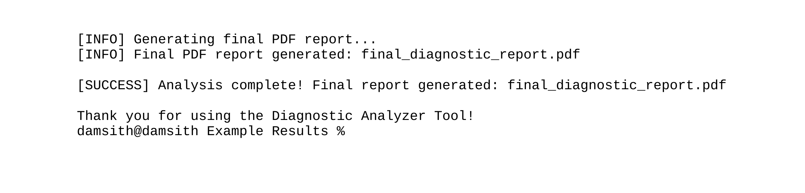
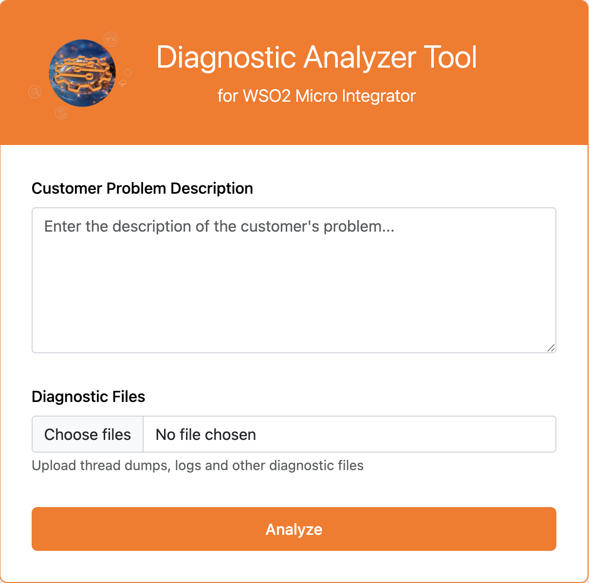
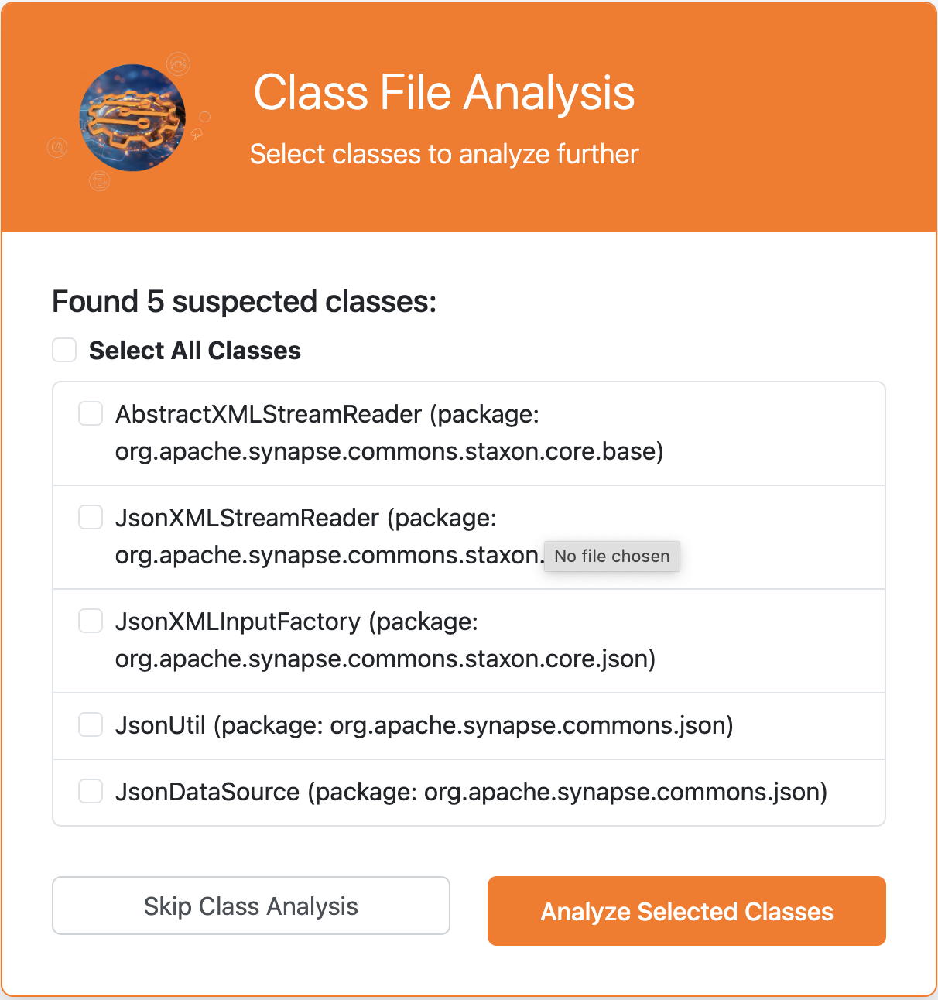
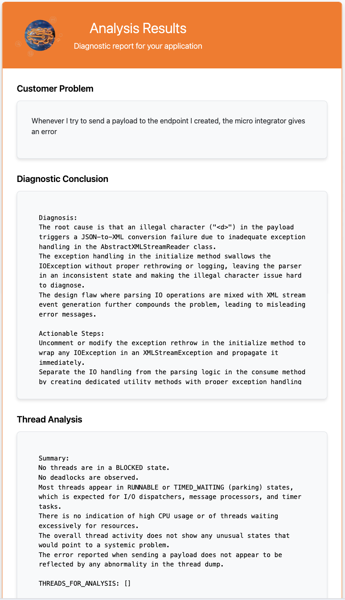

# Diagnostic Analyzer Tool


A powerful interactive diagnostic tool designed to analyze thread dumps and error logs to quickly identify and diagnose application issues. This tool can be used as a CLI tool as well as with it's web interface.

## 🔍 Overview

The Diagnostic Analyzer Tool is a comprehensive utility for troubleshooting WSO2 Micro Integrator by analyzing the diagnostic tool data which includes thread dumps, error logs, server info and related source files. It provides an interactive command-line interface that guides users through the diagnostic process, from problem description to solution identification.

## ✨ Features

- **Interactive CLI** with step-by-step diagnostic workflow
- **Thread Dump Analysis** that identifies problematic threads and patterns
- **Log File Analysis** to extract error messages and suspect classes
- **Source Code Analysis** for suspected problematic classes
- **Comprehensive Report Generation** with diagnostic conclusions
- **Configurable Thread Groups** for customized analysis

## 🏗️ Architecture

The Diagnostic Analyzer Tool follows a modular architecture designed for flexibility and extensibility:



### Requirements

- Python 3.8 or higher
- OpenAI API key (for AI-powered analysis)
- GITHUB Personal Access Token

### Setup

1. Clone the repository:
   ```
   git clone https://github.com/damaya0/diagnostic-analyzer.git
   cd diagnostic-analyzer
   ```

2. Install dependencies:
   ```
   pip install -r requirements.txt
   ```

3. Set up your OpenAI API key:
   ```
   export OPENAI_API_KEY="your-api-key-here"
   ```

4. (Optional) Set up GitHub token for code analysis:
   ```
   export GITHUB_TOKEN="your-github-token"

## Usage

## Command-Line Interface



The Diagnostic Analyzer Tool can be installed as a global CLI tool. To install it:
```bash
pip install .
```

1. Navigate to the directory where you want the analysis reports to be generated
2. Run the tool using the command:

```bash
diagnostic_analyzer
```

### Interactive Workflow:

1. Enter the customer problem description
2. Provide the path to the folder containing thread dumps and logs
3. Review thread dump analysis results
4. Review log analysis results
5. Optionally analyze related class files
6. Generate and review a comprehensive diagnostic report

## 🖥️ Example Screenshots





## Web Application

Start the web application:

```
cd web_app
python app.py
```

Then open your browser and navigate to `http://127.0.0.1:5000` to access the web interface.

#### Web Application Features

1. **Upload Diagnostic Files**: Upload thread dumps and log files
2. **Describe Your Problem**: Enter a description of the issue you're experiencing
3. **Review Analysis**: Get comprehensive analysis of threads, logs, and code
4. **Select Classes**: Choose which suspected classes to analyze further
5. **View Final Report**: Get a complete diagnostic conclusion with recommended solutions

## 🖥️ Example Screenshots









## ⚙️ How It Works

The Diagnostic Analyzer Tool operates through a sequence of analytical steps:

1. **Problem Description Analysis**:
   - Parses the customer problem description to identify key issues

2. **Thread Dump Analysis**:
   - Loads thread dumps from the specified directory
   - Categorizes threads based on predefined thread groups
   - Identifies blocked, waiting, and CPU-intensive threads
   - Extracts stack traces for suspicious threads

3. **Log Analysis**:
   - Parses error logs to identify exceptions and error patterns
   - Correlates log entries with thread activity
   - Identifies potentially problematic classes

4. **Class File Analysis**:
   - Examines source code of suspect classes
   - Identifies potential code issues related to the problem

5. **Diagnostic Conclusion**:
   - Combines all analysis results
   - Generates a comprehensive report with potential solutions

## 📂 Project Structure
```
├── .gitignore
├── README.md
├── diagnostic_analyzer_package
    ├── ThreadGroups.json
    ├── __init__.py
    ├── final_analyzer.py
    ├── log_analyzer.py
    ├── main.py
    ├── prompts.py
    ├── report.py
    ├── thread_analyzer.py
    ├── thread_dump_processor.py
    └── utils.py
├── screenshots
├── setup.py
└── web_app
    ├── app.py
    ├── session_data
    ├── static
        ├── css
        │   └── style.css
        ├── images
        └── js
        │   ├── class_selection.js
        │   └── main.js
    └── templates
        ├── error.html
        ├── index.html
        ├── results.html
        └── select_classes.html

```